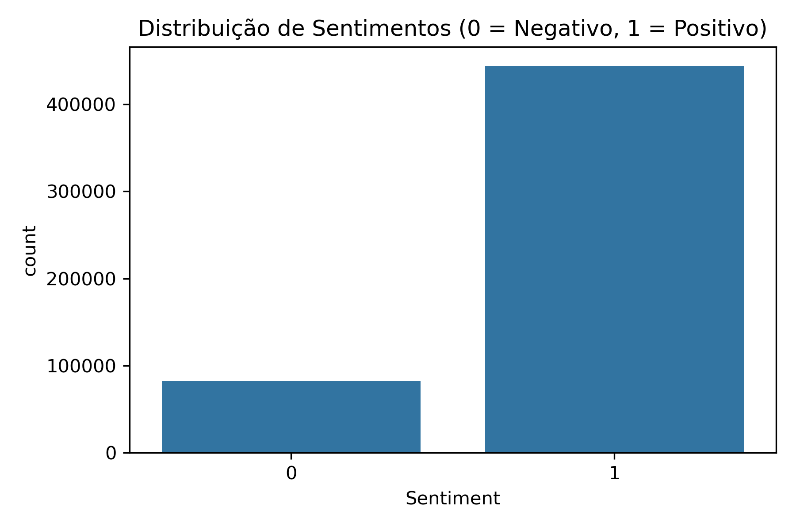
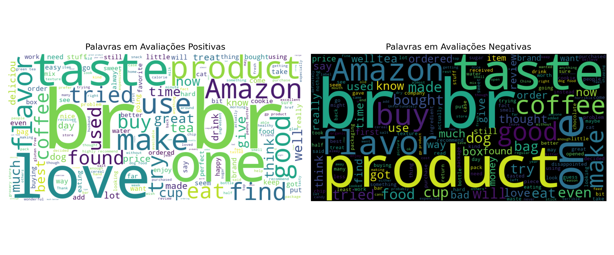
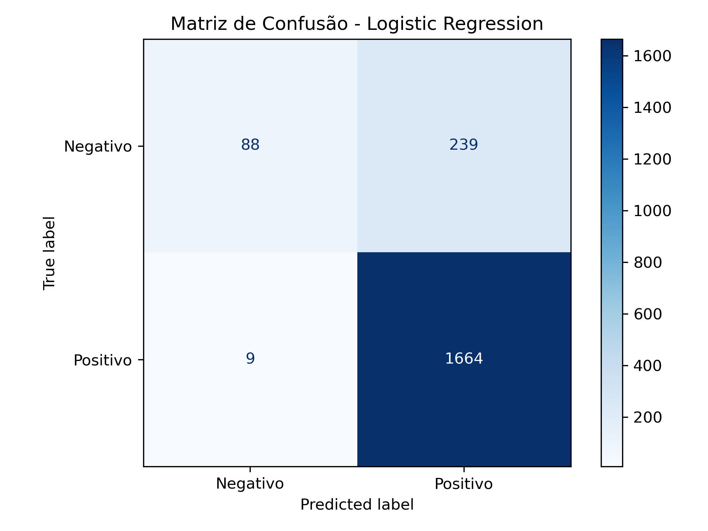
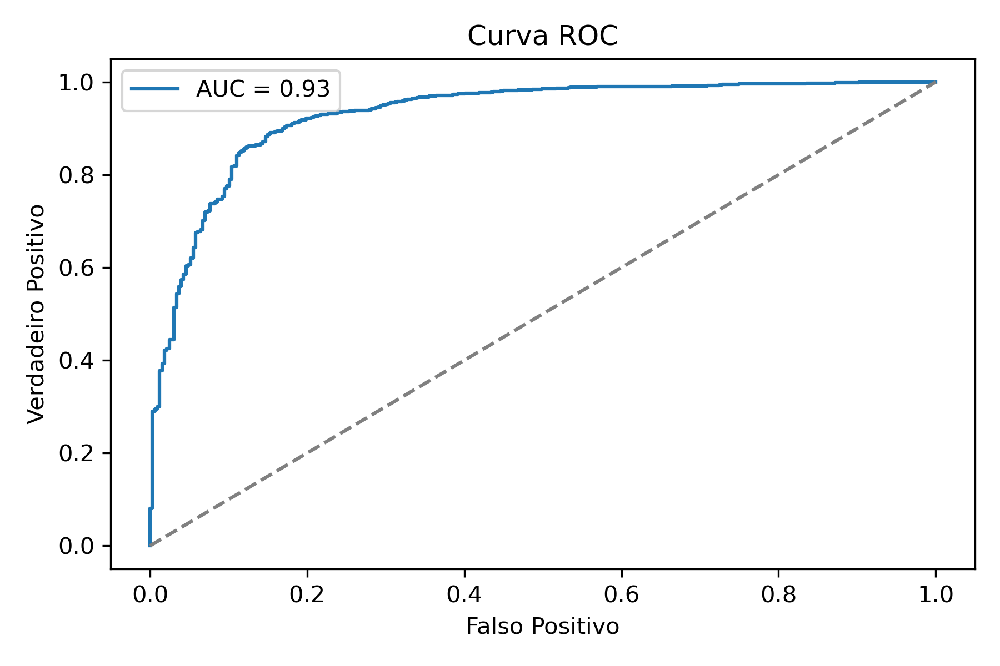
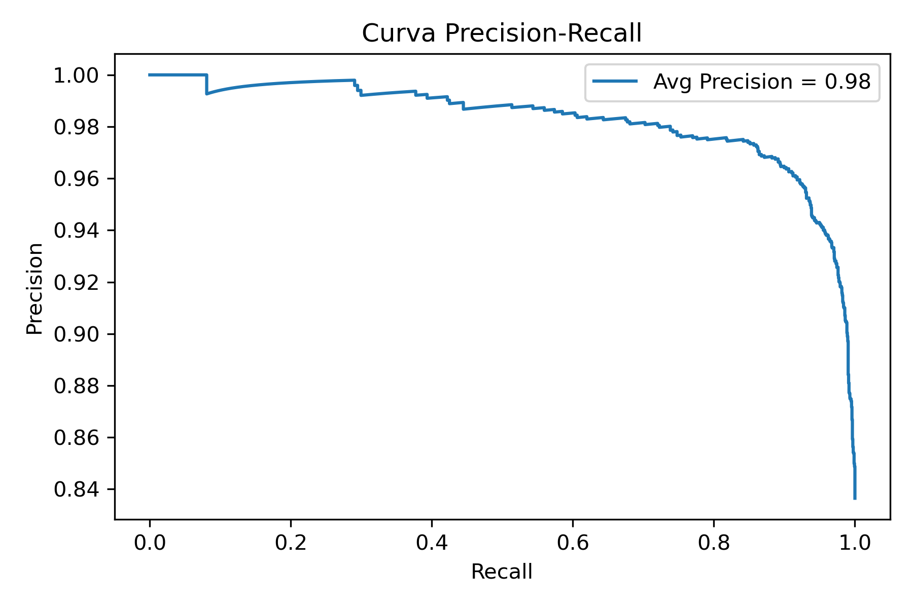

# Classificação de Sentimentos em Avaliações de Produtos com NLP

---

### 🎯 Objetivo do Projeto

O objetivo deste projeto é aplicar técnicas de **Processamento de Linguagem Natural (NLP)** para analisar e classificar sentimentos de avaliações de produtos. O modelo aprenderá a identificar se um review é **positivo ou negativo** , permitindo que empresas compreendam melhor o que os clientes estão dizendo e priorizem ações de melhoria.

---

### ⚙️Criando env

```
conda create --name cases_data_science python=3.10
conda activate cases_data_science
```

Se precisar deletar env

```
conda remove --name cases_data_science --all
```

Exportar notebook para md

```
jupyter nbconvert notebook.ipynb --to markdown --no-input

```

---

### 📊 Fonte e Explicação dos Dados

- **Fonte:** [Amazon Fine Food Reviews – Kaggle](https://www.kaggle.com/datasets/snap/amazon-fine-food-reviews)
- **Descrição:**

  Contém mais de 500.000 avaliações de alimentos da Amazon, incluindo:

  - `Score`: avaliação de 1 a 5 estrelas
  - `Text`: o conteúdo textual da avaliação
  - `Summary`: resumo da avaliação
  - `Time`, `UserId`, `ProductId`

Para o projeto, o score será **binarizado** (1-2 = negativo, 4-5 = positivo; 3 será removido).

---

### 📁 Estrutura de Pastas e Arquivos

```
sentiment-analysis-nlp-product-reviews/
│
├── data/
│   ├── raw/                     # Dados originais baixados do Kaggle
│   └── processed/               # Dados limpos e balanceados
│
├── notebooks/
│   ├── 01_eda.ipynb             # Análise exploratória e visualizações
│   ├── 02_preprocessing.ipynb   # Limpeza de texto e vetorização
│   ├── 03_modeling.ipynb        # Modelos de classificação (LogReg, Naive Bayes)
│   ├── 04_evaluation.ipynb      # Métricas, matriz de confusão e interpretação
│
├── reports/
│   └── figures/                 # Gráficos de palavras, nuvens, resultados
│
├── requirements.txt
└── README.md
```

---

### 🔁 Etapas do Processo

1. **Coleta e Filtragem dos Dados**
   - Apenas reviews com score 1, 2, 4 ou 5
   - Criação da coluna `sentiment`: positivo (1) ou negativo (0)
2. **Tratamento e Vetorização**
   - Limpeza de texto (remoção de pontuação, stopwords, etc.)
   - Vetorização com TF-IDF ou CountVectorizer
   - Alternativamente, embeddings como Word2Vec ou BERT (extra)
3. **Análise Exploratória**
   - Distribuição dos sentimentos
   - Nuvem de palavras por sentimento
   - Palavras mais comuns em reviews positivos/negativos
4. **Modelagem**
   - Modelos base: Logistic Regression, Naive Bayes
   - Métricas: Acurácia, F1-score, ROC-AUC
5. **Interpretação e Visualização**
   - Matriz de confusão
   - Exemplos de frases mal classificadas

---

### ⚙️ Como Executar Localmente

1. Clone o repositório:

```
git clone https://github.com/seuusuario/sentiment-analysis-nlp-product-reviews.git
cd sentiment-analysis-nlp-product-reviews
```

2. Crie um ambiente virtual (opcional) e instale as dependências:

```
pip install -r requirements.txt
```

3. Inicie os notebooks:
   ```
   jupyter notebook
   ```

Execute os notebooks em ordem para visualizar todo o pipeline.

---

### 📊 Salvar gráficos

Plotly precisa da biblioteca **kaleido** para exportar gráficos como imagem:

```
pip install -U kaleido
```

---

## ✅ Resultados

### 📊 Distribuição dos Sentimentos

Antes de aplicar modelos de classificação, foi analisada a distribuição dos sentimentos no conjunto de dados. O gráfico abaixo mostra a quantidade de avaliações rotuladas como:

- `0` → **Negativas**
- `1` → **Positivas**



Essa visualização é importante para verificar se os dados estão balanceados ou se há predominância de um dos sentimentos, o que pode afetar o desempenho dos modelos de aprendizado.

---

### 💬 Análise de Sentimentos – Wordclouds

Para entender melhor os principais termos mencionados nas avaliações dos clientes, foram geradas duas nuvens de palavras ( **wordclouds** ), separando comentários positivos e negativos.

- A nuvem à esquerda mostra os termos mais frequentes em **avaliações positivas** .
- A nuvem à direita mostra os termos recorrentes em **avaliações negativas** .

Essas visualizações ajudam a identificar rapidamente os **temas mais valorizados** e **principais pontos de insatisfação** entre os consumidores.


---

## 📊 Avaliação dos Modelos de Classificação de Sentimentos

Neste projeto, aplicamos **técnicas de Processamento de Linguagem Natural (NLP)** para classificar automaticamente avaliações de produtos da Amazon como **positivas ou negativas** . O objetivo principal foi desenvolver modelos capazes de interpretar textos e fornecer insights valiosos para empresas melhorarem seus produtos e serviços com base nas opiniões dos clientes.

---

### ⚙️ Modelos Testados

Foram avaliados dois algoritmos supervisionados clássicos:

- **Regressão Logística**
- **Naive Bayes Multinomial**

---

### 📌 Comparativo de Desempenho

| Modelo                  | Acurácia | Precision (Pos.) | Recall (Pos.) | F1-score (Pos.) | AUC  |
| ----------------------- | -------- | ---------------- | ------------- | --------------- | ---- |
| **Regressão Logística** | 0.88     | 0.87             | 0.99          | 0.93            | 0.93 |
| **Naive Bayes**         | 0.84     | 0.84             | 1.00          | 0.91            | 0.91 |

**Observações:**

- A **Regressão Logística** apresentou desempenho superior no geral, com melhor equilíbrio entre precisão e recall, especialmente para a classe negativa.
- O **Naive Bayes** teve recall perfeito (1.00) para a classe positiva, mas praticamente ignorou os exemplos negativos, classificando-os incorretamente (apenas 5% de recall para classe negativa).

---

### 📉 Problema de Desbalanceamento

A análise das métricas revelou um desequilíbrio na distribuição das classes, com a maioria das avaliações sendo **positivas** . Isso impacta o desempenho dos modelos, especialmente na identificação correta de avaliações negativas.

---

### 📷 Gráficos de Avaliação

#### 🔹 Matriz de Confusão – Regressão Logística

Mostra que o modelo tem **alta taxa de acerto para avaliações positivas** , mas comete erros ao prever avaliações negativas.




---

#### 🔹 Curva ROC – Regressão Logística

Exibe boa capacidade discriminativa com AUC de **0.93** , indicando que o modelo consegue separar bem as duas classes.



---

#### 🔹 Curva Precision-Recall

Alta precisão e recall, especialmente útil para dados desbalanceados como neste caso. A média da precisão é **0.98** .



---

### ✅ Conclusão

A **Regressão Logística** demonstrou ser o modelo mais adequado para esta tarefa, entregando alta **acurácia (0.88)** e **AUC (0.93)** . Apesar do desbalanceamento entre classes, o modelo conseguiu aprender bem o padrão das avaliações positivas e mostrou-se razoável nas negativas.

Futuramente, pode-se:

- Utilizar **técnicas de balanceamento** (como SMOTE)
- Explorar **modelos mais robustos** (como Random Forest ou BERT)
